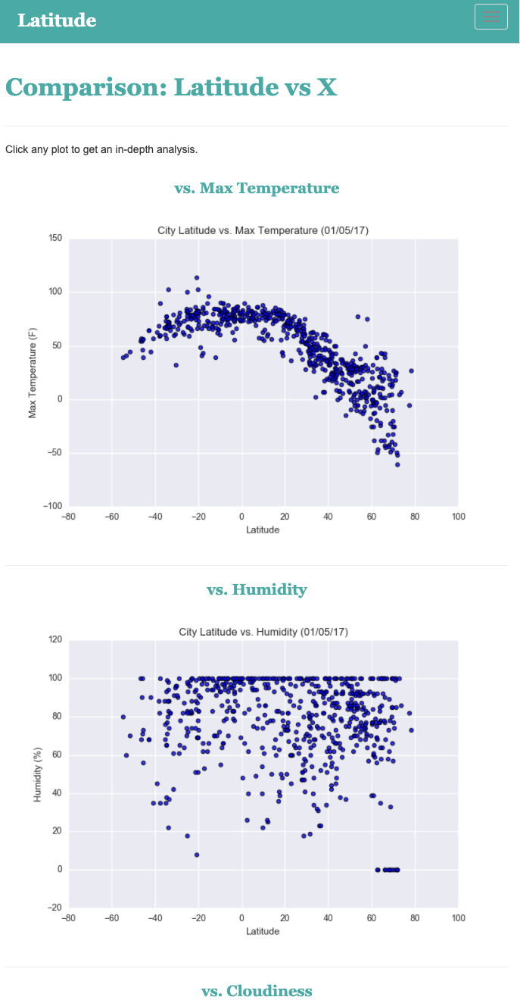

# Web Visualization Dashboard (Latitude).

Please Check The Link For Output @ https://RussCob.github.io/Web-Design-Project-HTML-CSS/WebVisualizations/Index.html

## Overview

In this project I used HTML and CSS for creating a dashboard showing off the analysis I've done before.

## Latitude - Latitude Analysis Dashboard with Attitude

In this project, a web visualization dashboard is created to show off the analysis of weather changes at different latitudes relative to the equator line. The data visualization shows temperature, humidity, cloudiness and wind speed trend using HTML5, CSS3, and Bootstrap4. It also provided insights that cities closer to the equator line are warmer.

### Website Requirements

The website must consist of 7 pages total, including:

* A [landing page](#landing-page) containing:
  * An explanation of the project.
  * Links to each visualizations page. There should be a sidebar containing preview images of each plot, and clicking an image should take the user to that visualization.
* Four [visualization pages](#visualization-pages), each with:
  * A descriptive title and heading tag.
  * The plot/visualization itself for the selected comparison.
  * A paragraph describing the plot and its significance.
* A ["Comparisons" page](#comparisons-page) that:
  * Contains all of the visualizations on the same page so we can easily visually compare them.
  * Uses a Bootstrap grid for the visualizations.
    * The grid must be two visualizations across on screens medium and larger, and 1 across on extra-small and small screens.
* A ["Data" page](#data-page) that:
  * Displays a responsive table containing the data used in the visualizations.
    * The table must be a bootstrap table component. [Hint](https://getbootstrap.com/docs/4.3/content/tables/#responsive-tables)
    * The data must come from exporting the `.csv` file as HTML, or converting it to HTML. Try using a tool you already know, pandas. Pandas has a nifty method approprately called `to_html` that allows you to generate a HTML table from a pandas dataframe. See the documentation [here](https://pandas.pydata.org/pandas-docs/version/0.17.0/generated/pandas.DataFrame.to_html.html)

The website must, at the top of every page, have a navigation menu that:

* Has the name of the site on the left of the nav which allows users to return to the landing page from any page.
* Contains a dropdown menu on the right of the navbar named "Plots" that provides a link to each individual visualization page.
* Provides two more text links on the right: "Comparisons," which links to the comparisons page, and "Data," which links to the data page.
* Is responsive (using media queries). The nav must have similar behavior as the screenshots ["Navigation Menu" section](#navigation-menu) (notice the background color change).

#### Landing page

Large screen:

# Small screen:



#### Comparisons page

# Large screen:

# Small screen:

#### Data page

# Large screen:

# Small screen:

#### Visualization pages

You'll build four of these, one for each visualization. Here's an example of one:

# Large screen:

# Small screen:

#### Navigation menu

# Large screen:

 # Small screen:

